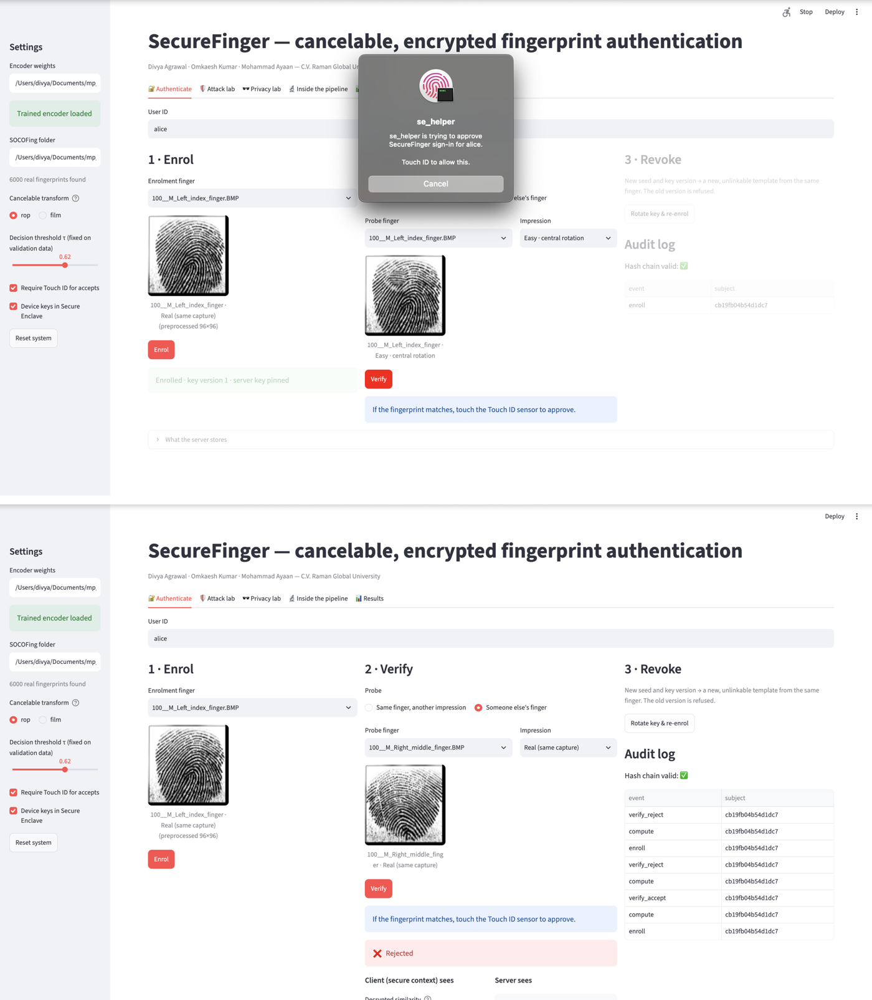

# SecureFinger

Cancelable, encrypted fingerprint authentication. Final-year B.Tech project, Department of Computer
Science and Engineering, C.V. Raman Global University, Bhubaneswar (2026).

**Authors:** Divya Agrawal, Omkaesh Kumar, Mohammad Ayaan · **Supervisor:** Dr. Ram Chandra Barik

**Pipeline:** ResNet-18 + ArcFace encoder → HKDF-SHA256 per-user key → random orthogonal projection (ROP)
cancelable template → CKKS encryption → encrypted matching on a FastAPI server, which signs the encrypted
score → the client's secure context checks that signature, decrypts and thresholds, and signs only the
accept/reject decision (ECDSA P-256, optionally in the Secure Enclave behind Touch ID) → JWT.
The server never stores or sees a plaintext template or a plaintext similarity score.

## Key results
| | |
|---|---|
| SOCOFing test EER (subject-disjoint) | 0.027% (2 false accepts in 7,431 impostor pairs) |
| Real multi-session data, 206 fingers / 11 sensors | 16.8% EER (nested selection); SourceAFIS minutiae: 5.8% |
| Linkability, ISO/IEC 24745 D<->sys | FiLM 1.00 (fully linkable); ROP below the noise floor |
| CKKS error vs plaintext | at most 1.2e-6; no decision changed |
| Verification latency (MacBook, 96 px) | 33.8 ms median; about 59 verifications/s |
| Automated security tests | 27 passing on Linux and macOS |

Raw outputs are in [`results/`](results/README.md). The encoder, not the privacy layer, limits accuracy.



## Setup (Python 3.10–3.12 recommended)
```bash
python -m venv .venv && source .venv/bin/activate      # Windows: .venv\Scripts\activate
pip install -r requirements.txt
```
If `pip install tenseal` fails on your Python version, create the venv with Python 3.11.
On a Mac, if TenSEAL has no prebuilt wheel for your Python, install the build tools
(`xcode-select --install`, `brew install cmake`) and rerun `pip install tenseal`; it compiles from
source (takes several minutes).

## 1 · Prototype demo (no dataset needed, ~10 s)
```bash
python quickstart.py              # documented FiLM design
python quickstart.py --method rop # orthogonal projection variant
```
Shows enrollment, genuine accept, impostor reject, replay rejection, tamper rejection,
key rotation (revocation), rollback rejection and the hash-chained audit log.

## 2 · Security tests
```bash
pytest -q tests          # 22 tests (Touch ID tests use a mock, so they run on any OS)
```

## Touch ID (macOS)
Touch ID **does not give access to the fingerprint image**, so it cannot replace the encoder input.
It is used for what the design calls platform biometric authorization: after the SecureContext
decides ACCEPT, it asks for Touch ID before releasing (using) the ECDSA signing key. The signed
payload then carries `user_presence: true`, and the token carries `uv: true`.
```bash
python -m securefinger.touchid        # self-test: shows the Touch ID prompt
python quickstart.py --touchid        # every accepted sign-in needs a touch
SF_REQUIRE_PRESENCE=1 uvicorn server.app:app   # server refuses accepts without Touch ID
```
In the Streamlit demo, tick "Require Touch ID for accepts" in the sidebar.
Scope: on its own the gate uses macOS LocalAuthentication with a software ECDSA key; add
`--secure-enclave` to keep the keys in the Secure Enclave (next section).

## 3 · Train the encoder (Colab GPU)
Open `notebooks/colab_train.ipynb` in Google Colab (T4 GPU), upload this repo as a zip, run all cells.
Or locally:
```bash
python experiments/train.py --data /path/to/SOCOFing --epochs 30 --out models
python experiments/evaluate.py --data /path/to/SOCOFing --weights models/encoder.pt --out results
```
Outputs: `models/encoder.pt` (weights + validation threshold), `models/encoder.onnx`,
`models/metrics.json` (val/test EER, FAR/FRR at the validation threshold, per-level results),
`results/eval.json` (plaintext vs FiLM vs ROP accuracy, linkability AUCs, CKKS error).

## 4 · Live demo app
Put the trained `models/encoder.pt` in `models/`, then:
```bash
streamlit run demo/app.py
```
Upload an enrollment image and a probe (e.g. a SOCOFing `Real/` image and its `Altered/` version),
then Enroll → Verify → Rotate key. Shows the decrypted score (local only), decision, per-stage
latency, audit chain and what the server stores.

## 5 · Run the server separately (optional)
```bash
uvicorn server.app:app --port 8000
```
`SecureFingerClient(httpx.Client(base_url="http://localhost:8000"), embedder=...)` uses the same
protocol over HTTP.

## 6 · Latency benchmark
```bash
python experiments/benchmark.py --image path/to/finger.BMP --weights models/encoder.pt --runs 100
```
Prints per-stage median/p95 and the machine description — report both.

## Upgrades (final stage)
| What | How to run |
|---|---|
| Secure Enclave device keys (Mac) | `swiftc -O tools/se_helper.swift -o tools/se_helper`, then `python -m securefinger.signers` (self-test), `python quickstart.py --method rop --touchid --secure-enclave`, or tick "Device keys in Secure Enclave" in the demo |
| Throughput load test (Mac) | terminal 1: `SF_DB=/tmp/sf_load.db uvicorn server.app:app --port 8000 --workers 4`; terminal 2: `python experiments/loadtest.py --levels 1 2 4 8 16 --seconds 20` |
| Harder protocols, seeds, D_sys linkability, Procrustes attack (Colab) | `notebooks/colab_experiments.ipynb` → `experiments/experiments.py` |
| FVC multi-session evaluation + OPA optimisation (Colab) | `notebooks/colab_upgrades.ipynb` → `experiments/fvc_eval.py`, `experiments/optimize.py` |

With `--secure-enclave --touchid`, ACCEPT decisions are signed by a second enclave key created with
`.biometryCurrentSet`: the Secure Enclave itself refuses to sign without Touch ID, and the server
refuses an ACCEPT signed by any other key. The ROP matrix is cached per key (up to 64 keys).

## Layout
```
securefinger/        core library: preprocess, encoder, keys, cancelable (ROP, FiLM), he (CKKS),
                     secure_context, signers (software / Secure Enclave), touchid, client, metrics
server/app.py        FastAPI + SQLite: enrol, challenge, compute (server-signed encrypted score),
                     finalize, JWT, hash-chained audit log
tests/               27 security tests (replay, tamper, rollback, forged score, rotation, unlinkability, ...)
demo/viva_app.py     five-tab Streamlit demo; demo/app.py is the older single-page demo
quickstart.py        terminal demo of the full protocol, no dataset needed
experiments/         training and every experiment in the report
  train.py, evaluate.py                       SOCOFing training and evaluation
  experiments.py, optimize.py                 harder protocols, D<->sys, Procrustes attack; OPA vs random search
  attacks_v3.py                               per-user known-plaintext attack, collection linkage
  fvc_eval.py, fvc_v2.py, fvc_nested.py,      real multi-session data: zero-shot, fine-tuning,
  fvc_hr.py                                   192 px recipe, nested selection, resolution study
  minutiae_baseline.py                        SourceAFIS baseline on the same pairs
  benchmark.py, loadtest.py                   latency per stage, throughput
notebooks/           Colab notebooks that run the experiments on a T4 GPU
tools/               Secure Enclave helper (Swift), SourceAFIS matcher (Java)
```
Run everything from the repository root, e.g. `python experiments/train.py ...`.

## Data
Datasets are not included; their licences do not allow redistribution.
- SOCOFing: https://www.kaggle.com/datasets/ruizgara/socofing
- FVC2000/2002/2004 set B and Neurotechnology samples: `experiments/fvc_eval.py` downloads them.

Trained weights (`models/encoder.pt`) are attached to the GitHub release, not stored in git.

## Scope and limitations
- Only the signing keys are in hardware (Secure Enclave on macOS). CKKS decryption and the
  server-signature check run in a software secure context; there is no TEE or attestation.
- CKKS is approximate (max error 1.2e-6 on 200 pairs); it changed no decision.
- FiLM is fully linkable by a magnitude attack (D<->sys = 1.00), so ROP is the adopted transform.
- A few leaked (embedding, template) pairs of one user invert that user's ROP templates; a key shared
  by a whole service makes its records linkable. Every user must have a separate key.
- SOCOFing results are optimistic (0.027% EER); on real multi-session data the encoder reaches
  16.8% EER against 5.8% for SourceAFIS. The encoder, not the privacy layer, limits accuracy.
- No presentation-attack or side-channel evaluation.

## Viva demo (five tabs)

```bash
streamlit run demo/viva_app.py
```
Tabs: Authenticate (enrol / verify / revoke, client vs server view, per-stage timing), Attack lab (replay, tamper, nonce reuse, forged score, rollback, stolen database), Privacy lab (cross-key linkage with ROP vs FiLM, live AUC), Inside the pipeline (image → embedding → template → ciphertext), Results (key numbers and charts). Expects the trained encoder in `models/encoder.pt` and SOCOFing in `../socofing_raw/SOCOFing` (both can be changed in the sidebar). The original single-page demo is still `demo/app.py`.
